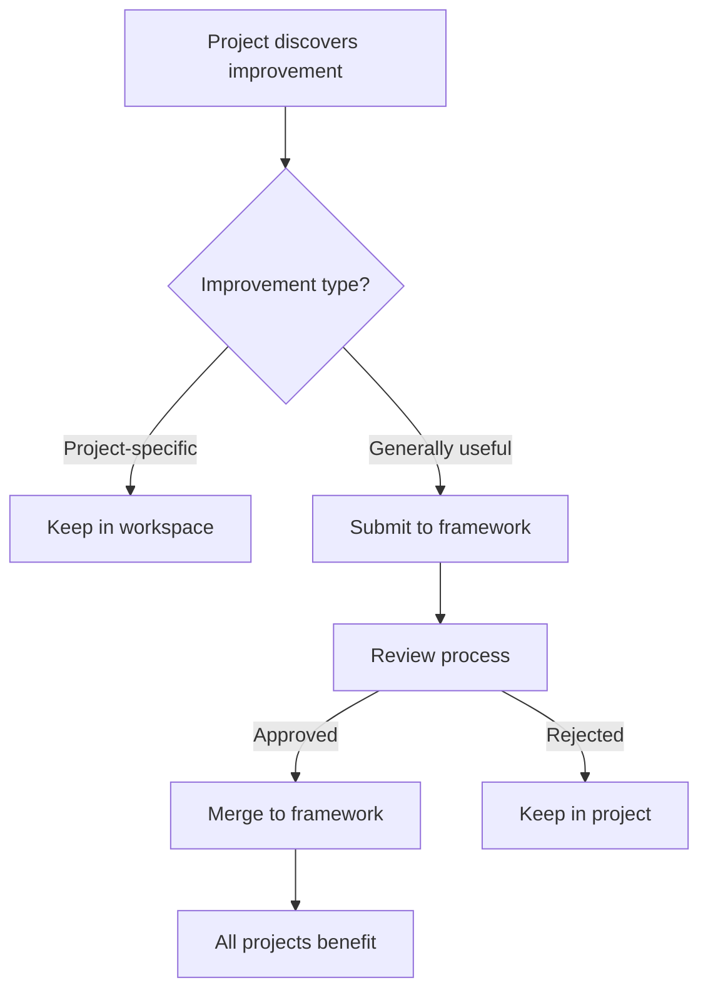

# Vibe-Agents Developer Guide

## Table of Contents
1. [Introduction](#introduction)
2. [Architecture Overview](#architecture-overview)
3. [Getting Started](#getting-started)
4. [Agent Development](#agent-development)
5. [Process Definitions](#process-definitions)
6. [Framework Integration](#framework-integration)
7. [Tool Integration](#tool-integration)
8. [Deployment Patterns](#deployment-patterns)
9. [Best Practices](#best-practices)
10. [Troubleshooting](#troubleshooting)

## Introduction

The vibe-agents framework enables developers to create AI-powered automation systems using natural language process definitions and role-based agents. Unlike traditional automation frameworks that require extensive coding, vibe-agents uses Claude Code as an intelligent runtime that interprets human-readable instructions.

### Core Principles
- **Natural Language First**: All configurations are human-readable markdown
- **Process-Driven**: Detailed workflows guide agent behavior
- **Role Specialization**: Agents load role-specific knowledge and behaviors
- **Tool Agnostic**: Works with any API-accessible tool
- **Continuous Learning**: Improvements flow through the framework hierarchy

## Architecture Overview

### System Components

```
┌─────────────────────────────────────────────────────────────┐
│                     Orchestration Layer                       │
│  ┌─────────────┐  ┌──────────────┐  ┌──────────────────┐   │
│  │   GitHub    │  │   Jenkins    │  │   Custom Tool    │   │
│  │   Events    │  │   Triggers   │  │   Webhooks       │   │
│  └─────┬───────┘  └──────┬───────┘  └────────┬─────────┘   │
│        │                  │                    │             │
│        └──────────────────┴────────────────────┘             │
│                           │                                   │
│                     ┌─────▼─────┐                            │
│                     │Orchestrator│                            │
│                     └─────┬─────┘                            │
└───────────────────────────┼───────────────────────────────────┘
                           │
┌───────────────────────────┼───────────────────────────────────┐
│                     Agent Layer                                │
│  ┌─────────────┐  ┌─────┴──────┐  ┌──────────────────┐      │
│  │ Dev Agent   │  │ QA Agent   │  │ DevOps Agent     │      │
│  │             │  │            │  │                  │      │
│  │ ┌─────────┐ │  │ ┌────────┐ │  │ ┌──────────┐   │      │
│  │ │ Claude  │ │  │ │ Claude │ │  │ │  Claude  │   │      │
│  │ │  Code   │ │  │ │  Code  │ │  │ │   Code   │   │      │
│  │ └────┬────┘ │  │ └───┬────┘ │  │ └────┬─────┘   │      │
│  │      │      │  │     │      │  │      │         │      │
│  │ ┌────▼────┐ │  │ ┌───▼────┐ │  │ ┌────▼─────┐   │      │
│  │ │CLAUDE.md│ │  │ │CLAUDE.md│ │  │ │CLAUDE.md │   │      │
│  │ │ (role)  │ │  │ │ (role) │ │  │ │  (role)  │   │      │
│  │ └─────────┘ │  │ └────────┘ │  │ └──────────┘   │      │
│  └─────────────┘  └────────────┘  └──────────────────┘      │
└───────────────────────────────────────────────────────────────┘
                           │
┌───────────────────────────┼───────────────────────────────────┐
│                   Framework Layer                              │
│                   ┌───────▼────────┐                          │
│                   │ vibe-agents    │                          │
│                   │  framework     │                          │
│                   │                │                          │
│                   │ ├── agents/    │ (Role definitions)       │
│                   │ ├── processes/ │ (Workflow templates)     │
│                   │ ├── setup/     │ (Setup scripts)          │
│                   │ └── docs/      │ (Documentation)          │
│                   └────────────────┘                          │
└───────────────────────────────────────────────────────────────┘
```

### Key Concepts

#### 1. Agents
Agents are Claude Code instances enhanced with:
- **Role Definition** (`CLAUDE.md`): Behavioral instructions
- **Process Knowledge**: Workflow templates from framework
- **Tool Access**: Full system capabilities
- **Workspace**: Isolated working directory

#### 2. Shared Workspace Repository
Central coordination hub containing:
- **Project CLAUDE.md**: Project-specific instructions
- **Documentation**: Concepts, architecture, guides
- **Task Management**: Issues, roadmaps, backlogs
- **Knowledge Base**: Accumulated learnings

#### 3. Framework Hierarchy
Three-tier structure for scalable knowledge management:
```
Universal Framework (vibe-agents)
    ↓
Company Framework (optional)
    ↓
Project Workspace (active implementation)
```

## Getting Started

### Prerequisites
- Linux/Unix server with SSH access
- Git installed and configured
- GitHub CLI (`gh`) authenticated
- Claude Code installed and activated

### Quick Start

#### 1. Clone the Framework
```bash
git clone https://github.com/cloudhippie/vibe-agents.git
cd vibe-agents
```

#### 2. Set Up a Simple Agent
```bash
# Run the setup script
./agents/setup-simple-agent.sh your-server-ip

# This will:
# - Create /work/dev/ directory structure
# - Clone workspace repository
# - Set up run.sh script
# - Validate requirements
```

#### 3. Test the Agent
```bash
# SSH to your server
ssh agent@your-server-ip

# Run manually
cd /work/dev
./run.sh

# Check logs
tail -f agents.log
```

#### 4. Enable Automation
```bash
# Enable cron-based execution
./agents/agent-control.sh enable dev

# Monitor status
./agents/monitor-agent.sh your-server-ip dev
```

## Agent Development

### Creating a New Agent Role

#### 1. Define the Role
Create `vibe-agents/agents/[role-name]/CLAUDE.md`:

```markdown
# [Role Name] Agent

You are a [role] agent responsible for [primary responsibility].

## Core Responsibilities
- [Responsibility 1]
- [Responsibility 2]
- [Responsibility 3]

## Workflow
1. [Step 1]
2. [Step 2]
3. [Step 3]

## Tools and Access
- [Tool 1]: [How to use it]
- [Tool 2]: [How to use it]

## Quality Standards
- [Standard 1]
- [Standard 2]

## Communication
- [When to communicate]
- [How to communicate]
- [What to communicate]
```

#### 2. Create Supporting Process
Add workflow templates in `vibe-agents/processes/[workflow-name].md`:

```markdown
# [Workflow Name]

## Overview
[Brief description of the workflow]

## Prerequisites
- [ ] [Prerequisite 1]
- [ ] [Prerequisite 2]

## Steps
1. **[Step Name]**
   - Action: [What to do]
   - Tools: [What tools to use]
   - Validation: [How to verify success]

2. **[Step Name]**
   - Action: [What to do]
   - Tools: [What tools to use]
   - Validation: [How to verify success]

## Success Criteria
- [ ] [Criterion 1]
- [ ] [Criterion 2]

## Error Handling
- If [error condition]: [recovery action]
- If [error condition]: [recovery action]
```

#### 3. Implement Agent Wrapper
Create execution script `/work/[role]/run.sh`:

```bash
#!/bin/bash
# [Role] Agent execution script

WORKSPACE_DIR="/work/[role]"
LOCKFILE="$WORKSPACE_DIR/.lockfile"
LOGFILE="$WORKSPACE_DIR/agents.log"

# Prevent concurrent runs
if [ -f "$LOCKFILE" ]; then
    PID=$(cat "$LOCKFILE")
    if ps -p $PID > /dev/null 2>&1; then
        echo "Agent already running with PID $PID"
        exit 1
    fi
fi

# Create lock
echo $$ > "$LOCKFILE"
trap "rm -f $LOCKFILE" EXIT

# Update CLAUDE.md from framework
cd /path/to/vibe-agents
git pull
cp agents/[role]/CLAUDE.md "$WORKSPACE_DIR/CLAUDE.md"

# Execute Claude
cd "$WORKSPACE_DIR"
claude "Check for work and execute highest priority task" 2>&1 | tee -a "$LOGFILE"
```

### Agent Communication Patterns

#### 1. Task Discovery (Pull Model)
```markdown
## Task Discovery Process
1. Query task management system for ready work
2. Validate prerequisites are met
3. Claim highest priority task
4. Update task status to "in-progress"
```

#### 2. Event-Driven (Push Model)
```markdown
## Event Handler
When triggered by [event]:
1. Validate event payload
2. Determine required action
3. Execute workflow
4. Report results
```

#### 3. Peer-to-Peer Handoff
```markdown
## Handoff Protocol
When passing work to [other-role]:
1. Complete your portion
2. Update shared workspace
3. Create handoff artifact
4. Notify next agent via [method]
```

## Process Definitions

### Structure of a Process Definition

```markdown
# Process Name

## Metadata
- **Type**: [build|deploy|test|review|etc]
- **Roles**: [List of agents that execute this]
- **Triggers**: [What initiates this process]
- **Dependencies**: [Required processes or conditions]

## Definition of Ready
Before this process can begin:
- [ ] [Prerequisite 1]
- [ ] [Prerequisite 2]
- [ ] [Required resource available]
- [ ] [Required approval obtained]

## Process Steps

### Step 1: [Name]
**Actor**: [Role responsible]
**Action**: [Detailed description of what to do]
**Tools**: 
- [Tool 1]: [Specific command or usage]
- [Tool 2]: [Specific command or usage]
**Validation**:
- [ ] [How to verify this step succeeded]
- [ ] [Quality check to perform]
**Error Handling**:
- If [error]: Then [recovery action]

### Step 2: [Name]
[Same structure as above]

## Definition of Done
The process is complete when:
- [ ] [Completion criterion 1]
- [ ] [Completion criterion 2]
- [ ] [All quality gates passed]
- [ ] [Required notifications sent]

## Rollback Procedure
If the process fails:
1. [Rollback step 1]
2. [Rollback step 2]
3. [Notification procedure]
```

### Example: Code Review Process

```markdown
# Code Review Process

## Metadata
- **Type**: review
- **Roles**: dev, senior-dev, qa
- **Triggers**: Pull request creation/update
- **Dependencies**: CI build must pass

## Definition of Ready
- [ ] PR has clear description
- [ ] All CI checks are passing
- [ ] No merge conflicts exist
- [ ] Issue reference included

## Process Steps

### Step 1: Automated Review
**Actor**: dev agent
**Action**: Perform initial code quality checks
**Tools**: 
- `gh pr view`: Get PR details
- Code analysis tools: Run linting, security scans
**Validation**:
- [ ] No critical linting errors
- [ ] No security vulnerabilities
- [ ] Test coverage maintained/improved

### Step 2: Functional Review
**Actor**: senior-dev agent
**Action**: Review code logic and architecture
**Validation**:
- [ ] Follows project patterns
- [ ] Efficient implementation
- [ ] Proper error handling

### Step 3: Test Validation
**Actor**: qa agent
**Action**: Verify test completeness
**Validation**:
- [ ] Unit tests for new code
- [ ] Integration tests updated
- [ ] Edge cases covered

## Definition of Done
- [ ] All automated checks pass
- [ ] No unresolved review comments
- [ ] Approval from required reviewers
- [ ] Documentation updated
```

## Framework Integration

### Using the Framework Hierarchy

#### 1. Universal Framework
Base definitions all projects inherit:
```
vibe-agents/
├── agents/
│   ├── dev/
│   │   └── CLAUDE.md         # Universal dev role
│   └── qa/
│       └── CLAUDE.md         # Universal QA role
└── processes/
    ├── code-review.md        # Standard review process
    └── deployment.md         # Standard deployment process
```

#### 2. Company Framework (Optional)
Organization-specific adaptations:
```
company-framework/
├── agents/
│   └── dev/
│       └── CLAUDE.md         # Company-specific additions
└── processes/
    └── compliance-check.md   # Company-required process
```

#### 3. Project Workspace
Active implementation:
```
project-workspace/
├── CLAUDE.md                 # Project-specific instructions
├── .agent-overrides/
│   └── dev/
│       └── CLAUDE.md        # Project-specific dev overrides
└── processes/
    └── custom-workflow.md    # Project-unique process
```

### Loading Order
Agents load instructions in this priority:
1. Project workspace overrides (highest)
2. Company framework additions
3. Universal framework (base)

### Framework Evolution



## Tool Integration

### Integration Patterns

#### 1. API-Based Integration
```markdown
## GitHub Integration
**Authentication**: Use GitHub CLI with PAT
**Commands**:
- List issues: `gh issue list --json number,title,body`
- Create PR: `gh pr create --title "..." --body "..."`
- Check status: `gh pr checks`
```

#### 2. CLI Tool Integration  
```markdown
## kubectl Integration
**Setup**: Ensure kubeconfig is available
**Commands**:
- Deploy: `kubectl apply -f manifest.yaml`
- Check status: `kubectl get pods -n namespace`
- View logs: `kubectl logs -f pod-name`
```

#### 3. Web API Integration
```markdown
## Slack Integration
**Method**: HTTP POST to webhook
**Payload**:
{
  "text": "Deployment complete",
  "channel": "#deployments"
}
```

### Tool Discovery Process

Agents learn new tools through:

1. **Documentation Reading**
```markdown
When encountering new tool [tool-name]:
1. Look for README or docs
2. Identify key commands
3. Test in safe environment
4. Document usage patterns
```

2. **Experimentation**
```markdown
## Tool Exploration
1. Run help command: `tool --help`
2. List available subcommands
3. Test basic operations
4. Build command library
```

## Deployment Patterns

### Simple Agent (Cron-Based)

Best for: Starting out, simple workflows

```bash
# Setup
./setup-simple-agent.sh server-ip

# Enable
./agent-control.sh enable agent-name

# Monitor
./monitor-agent.sh server-ip agent-name
```

**Characteristics**:
- Runs every minute via cron
- Single task at a time
- Simple state management
- Easy debugging

### Event-Driven Agent

Best for: Reactive workflows, real-time response

```python
# Webhook receiver example
from flask import Flask, request
import subprocess

app = Flask(__name__)

@app.route('/webhook', methods=['POST'])
def handle_webhook():
    event = request.json
    
    # Trigger appropriate agent
    if event['type'] == 'pull_request':
        subprocess.run(['claude', 'Review PR ' + event['pr_number']])
    
    return 'OK', 200
```

### Orchestrated Agents

Best for: Complex workflows, multiple agents

```yaml
# Orchestration configuration
workflows:
  feature_development:
    steps:
      - agent: product-owner
        action: create_specification
      - agent: architect  
        action: design_solution
      - agent: dev
        action: implement_feature
      - agent: qa
        action: test_feature
      - agent: devops
        action: deploy_feature
```

### Distributed Agents

Best for: Scale, resilience

```
┌─────────────┐     ┌─────────────┐     ┌─────────────┐
│   Server 1  │     │   Server 2  │     │   Server 3  │
│             │     │             │     │             │
│ ┌─────────┐ │     │ ┌─────────┐ │     │ ┌─────────┐ │
│ │Dev Agent│ │     │ │QA Agent │ │     │ │DevOps   │ │
│ └─────────┘ │     │ └─────────┘ │     │ │Agent    │ │
└─────────────┘     └─────────────┘     │ └─────────┘ │
                                        └─────────────┘
        │                   │                   │
        └───────────────────┴───────────────────┘
                           │
                    ┌──────▼──────┐
                    │ Orchestrator │
                    │   (Central)  │
                    └──────────────┘
```

## Best Practices

### 1. Process Definition
- **Be Explicit**: Leave no room for interpretation
- **Include Examples**: Show exactly what success looks like
- **Handle Errors**: Define recovery for every failure mode
- **Version Control**: Track all process changes

### 2. Agent Design
- **Single Responsibility**: Each agent has one clear role
- **Stateless Operation**: Agents can restart anytime
- **Idempotent Actions**: Running twice = running once
- **Clear Communication**: Over-communicate status

### 3. Workspace Management
```
/work/[agent]/
├── CLAUDE.md              # Current instructions
├── agents.log             # Execution history
├── .lockfile              # Prevent concurrent runs
└── issue-[num]/           # Task-specific workspace
    ├── README.md          # Task documentation
    └── project/           # Actual work directory
```

### 4. Error Handling
```markdown
## Error Recovery Pattern
try:
    1. Attempt primary approach
catch SpecificError:
    2. Try alternative approach
    3. Log detailed context
catch GeneralError:
    4. Preserve state
    5. Escalate to human
    6. Provide recovery instructions
```

### 5. Testing Agents
```bash
# Test framework changes
cd test-workspace
ln -s ../vibe-agents/agents/dev/CLAUDE.md .
claude "Simulate task execution"

# Test with specific scenario
claude "Given issue #123 with [scenario], execute task"
```

### 6. Monitoring and Observability
```bash
# Real-time monitoring
tail -f /work/*/agents.log

# Check all agents
./monitor-agent.sh server-ip

# Performance metrics
grep "execution_time" /work/*/agents.log | analyze
```

## Troubleshooting

### Common Issues

#### Agent Not Starting
```bash
# Check cron
crontab -l | grep agent

# Check lockfile
ls /work/*/. lockfile

# Check permissions
ls -la /work/agent-name/

# Test manually
cd /work/agent-name && ./run.sh
```

#### Task Not Being Picked Up
```markdown
## Diagnosis Steps
1. Verify task meets Definition of Ready
2. Check agent can see task: `gh issue list`
3. Verify agent authentication: `gh auth status`
4. Check agent logs for errors
5. Test task discovery manually
```

#### Agent Stuck on Task
```bash
# Remove lockfile
rm /work/agent-name/.lockfile

# Check running processes
ps aux | grep claude

# Review logs
tail -100 /work/agent-name/agents.log

# Check task state
ls /work/agent-name/issue-*/
```

### Debug Mode
```bash
# Enable verbose logging
export CLAUDE_DEBUG=true
./run.sh

# Trace execution
strace -f ./run.sh

# Profile performance
time ./run.sh
```

### Recovery Procedures

#### Corrupted Workspace
```bash
# Backup current state
mv /work/agent /work/agent.backup

# Recreate from framework
./setup-simple-agent.sh server-ip

# Restore task workspaces
mv /work/agent.backup/issue-* /work/agent/
```

#### Framework Sync Issues
```bash
# Force framework update
cd /path/to/vibe-agents
git fetch --all
git reset --hard origin/main

# Propagate to agents
for agent in /work/*/; do
    cp agents/*/CLAUDE.md $agent/
done
```

## Advanced Topics

### Custom Orchestration
Implement domain-specific orchestration:

```python
class WorkflowOrchestrator:
    def __init__(self):
        self.agents = {}
        self.workflows = load_workflows()
    
    def execute_workflow(self, workflow_name, context):
        workflow = self.workflows[workflow_name]
        
        for step in workflow.steps:
            agent = self.get_agent(step.role)
            result = agent.execute(step.action, context)
            
            if not result.success:
                self.handle_failure(step, result)
                return
            
            context.update(result.data)
        
        return context
```

### Multi-Agent Coordination
```yaml
coordination_patterns:
  parallel_execution:
    - group:
      - agent: frontend-dev
        task: implement_ui
      - agent: backend-dev  
        task: implement_api
    - sync_point: integration_test
  
  pipeline_execution:
    - agent: designer
      output: design_specs
    - agent: dev
      input: design_specs
      output: implementation
    - agent: qa
      input: implementation
      output: test_results
```

### Performance Optimization
```markdown
## Optimization Strategies
1. **Parallel Task Discovery**
   - Query multiple sources concurrently
   - Cache frequently accessed data
   
2. **Workspace Preloading**
   - Clone common dependencies in advance
   - Maintain workspace templates
   
3. **Incremental Processing**
   - Track last processed state
   - Only handle changes
   
4. **Resource Pooling**
   - Reuse connections
   - Share computed results
```

## Contributing

### Submitting Improvements
1. Test in project workspace first
2. Document the improvement clearly
3. Submit PR to framework repository
4. Include examples and use cases

### Framework Evolution Process
```
Idea → Project Testing → Validation → Framework PR → Review → Integration
```

### Community Resources
- **GitHub Discussions**: Architecture decisions
- **Issues**: Bug reports and features
- **Wiki**: Extended documentation
- **Examples**: Reference implementations

## Conclusion

The vibe-agents framework represents a paradigm shift in automation - from code-centric to process-centric, from rigid to adaptive, from isolated to collaborative. By leveraging natural language definitions and AI-powered execution, developers can create sophisticated automation systems that improve continuously and adapt to changing needs.

Start simple with one agent, one process. As you gain experience, expand to multi-agent workflows and complex orchestrations. The framework grows with your needs while maintaining simplicity at its core.

**Remember**: The goal isn't to replace developers but to amplify their impact by handling the repetitive, process-driven work that computers excel at, freeing humans for creative problem-solving and innovation.